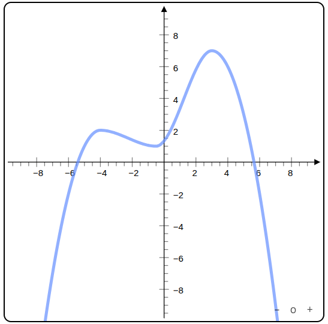

import { DoenetViewer, DoenetEditor } from "@doenet/doenetml-iframe";

How many times have you experienced a student plowing through an activity oblivious to their misconceptions and ignoring your carefully designed instructions to make them reflect? By the time you hand the activity back with feedback, either:

1. the misconceptions are further entrenched, or
2. the student is resistant to reexamining them.

I’m sure there are many ways to deal with this problem, but I’ve found one antidote that works particularly well for my classes. My solution is to give students interactive, scaffolded activities that provide immediate feedback and nudge them in the right direction. These activities force students to confront their misunderstandings, turn off autopilot, and engage with the content.

I like to call these adventures _interactive exploratory activities_, as the ability to explore within the constraints of the activity gives students the space to tinker and reflect. I typically have students work through them when they are first learning a new concept.


Here's a snippet from one of these activities where students discover how to sketch solutions to differential equations even without solving them.


Despite how well my students respond to interactive exploratory activities, one thing I have discovered after writing hundreds is that **making them is a huge pain!** For the past couple decades, I've been working on ways to ease that pain.

<div data-excerpt />

When I started to experiment in 2005 with creating my own interactives, I was teaching multivariable calc, so my efforts mostly took the form of 3D applets. [Here’s an example](https://mathinsight.org/directional_derivative_gradient_introduction) from 2011 about directional derivatives and gradients.


It’s a pretty neat little interactive. The important part to me was that students could “reach out and touch it”, metaphorically speaking - that they could gain an intuitive understanding from moving the point around and adjusting the angle. The problem: This little interactive took me at least 20 hours to make. I had to:

- create all the geometries,
- translate mouse coordinates into the 3D model to enable interactions,
- write custom code to keep all the vectors, sliders, points, and panels in sync.

That’s 20 hours for this one applet, not including the technology I had to learn to make it happen.

I've searched for ways to lessen the burden of developing interactive activities. Over the years, I’ve tried different technologies (including other software packages and systems I created myself), and none of them significantly reduced the time. Instead, as I focused more on scaffolding activities and providing instant feedback, I found that activities were requiring even more effort to develop.

After struggling with different ad-hoc approaches, including building the technology behind [Math Insight](https://mathinsight.org), I decided I needed to step back and reexamine what an author of interactive activities really cares about.

What really matters is the _meaning of the objects being displayed_ and the _relationships among them_. What if we could design a semantic way to describe the desired objects and their relationships? Maybe all the author has to do is specify how the pieces fit together and the software can determine how to make the interactive experience for the student.


This realization inspired the Doenet project, which a group of us started around 2018. We designed an approach to give authors the ability to create interactives via a semantic description. Our goal is to let math instructors more easily make interactive visual activities for their classes.

For example, if I am creating a problem about local maxima, and I want to illustrate a function with two maxima, I don't usually care about the details of the function. I just want to say "give me a graph of a function with maxima at $(-4,2)$ and $(3,7)$." In Doenet, we can say this as simply as

```xml
<graph>
  <function maxima="(-4,2) (3,7)" />
</graph>
```

and out pops a graph that matches my criteria.



For students to engage, I want them to interact with the graph to solve a problem. Maybe I want them to draw a graph of a function that has a single maximum of about 6. This shouldn't be that much more difficult for me to specify. I have to give them three movable points, say $A$, $B$, and $C$, and a function $f$ through those points. In Doenet, we could describe this relationship with the following:

```xml
<graph>
  <point name="A">(-1,3)</point>
  <point name="B">(4,6)</point>
  <point name="C">(-8,-1)</point>
  <function name="f" through="$A $B $C" />
</graph>
```

We used the notation `$A` to indicate a reference to point $A$.

Once we've specified the relationship between the points and the function, if a student moves a point around, the function will change to always go through the points. We're all set to specify a task and give students feedback or score to indicate how well they met the task objectives.

For instance, if I want students to draw a function with a maximum at 6, I need to specify that I want to award credit for their answer when $f$ has a single maximum whose value is 6, maybe allowing 10% wiggle room as being close enough. In Doenet, we keep this manageable by allowing us to specify these instructions as:

```xml
<answer allowedErrorInNumbers="0.1">
  <award><when>$f.maximumValues = 6</when></award>
</answer>
```

With those instructions, if students move the points to create a function with a single maximum close to 6, they should get feedback that their graph is correct.

See the result below. You can move the three points. If you can get the maximum of the function to be within 10% of 6, Doenet will display "Correct" when you click the Check Work button.

export const checkMaximum = `<graph>
  <shortDescription>
    A function through three movable points
  </shortDescription>

  <point name="A">(-1,3)</point>
  <point name="B">(4,6)</point>
  <point name="C">(-8,-1)</point>
  <function name="f" through="$A $B $C" />
</graph>

<p>Move the points to draw a function that has a maximum of 6.</p>
<answer allowedErrorInNumbers="0.1">
  <award>
    <when>$f.maximumValues = 6</when>
  </award>
</answer>
`;

<DoenetEditor
  doenetML={checkMaximum}
  client:only="react"
  showFormatter={false}
  showErrorsWarnings={false}
  showResponses={false}
/>

(The above full example also includes two refinements: a short description of the graph that can be read by screen readers and a paragraph of instructions for the students.)

I hope these examples give you a glimpse of how you can create interactives for your students using a semantic description!

Doenet is our attempt to create the technology and a social context where instructors can support each other while creating cool activities, collaborating and sharing the fruits of our labor.

You shouldn’t have to be a technical guru to let your students play.
